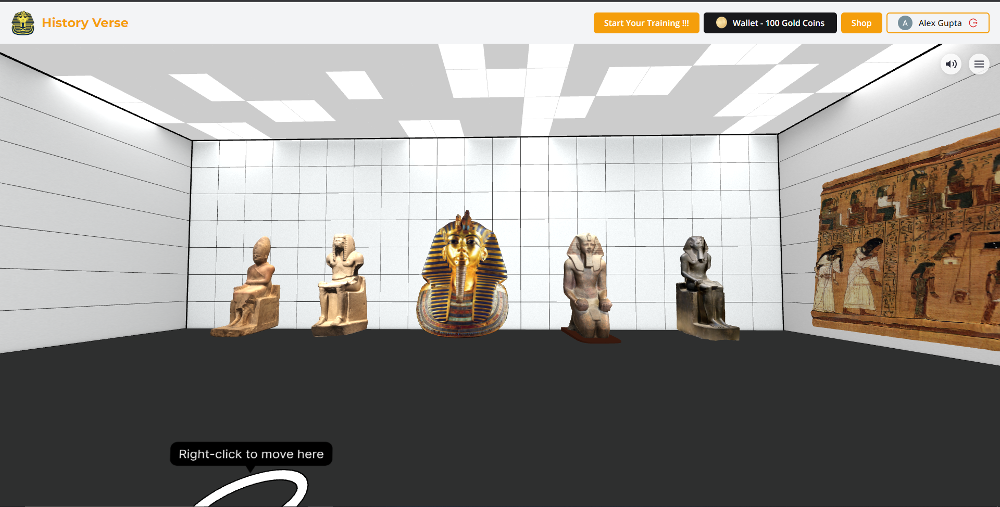
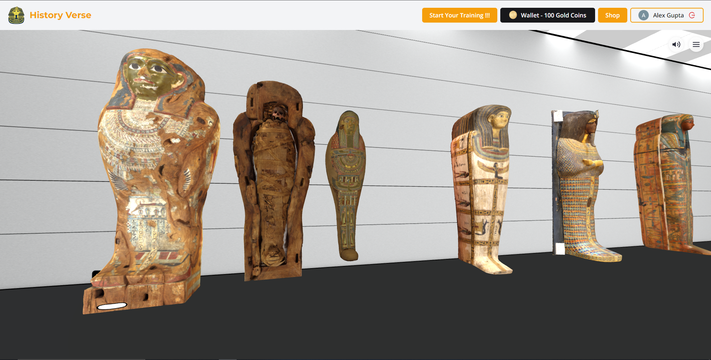
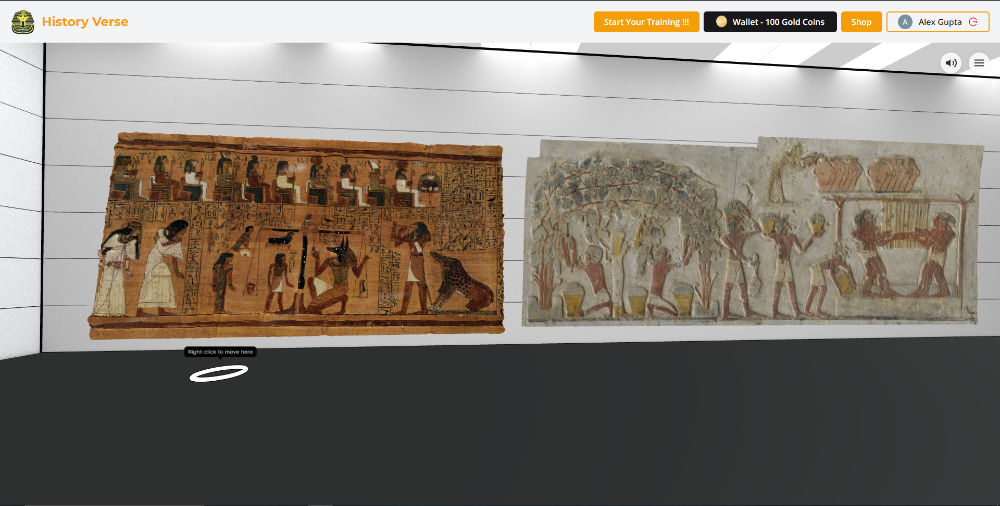
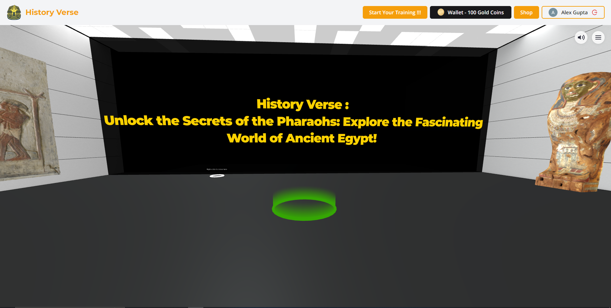
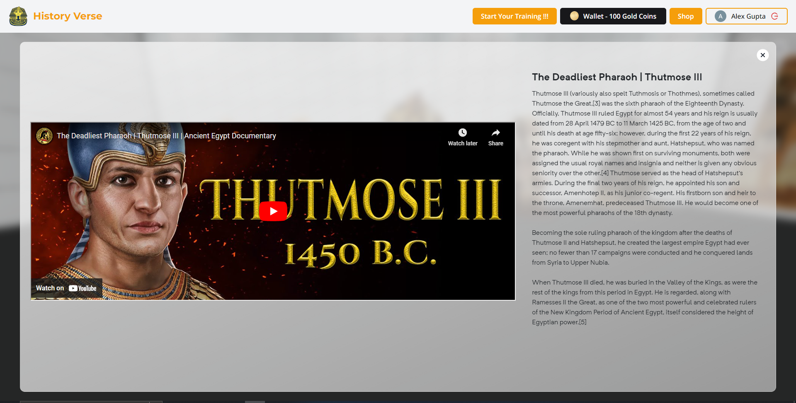
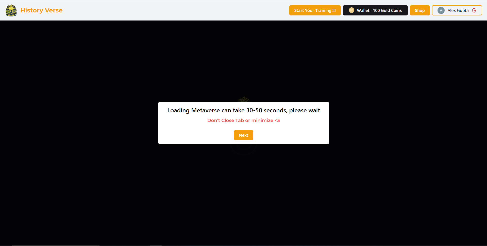
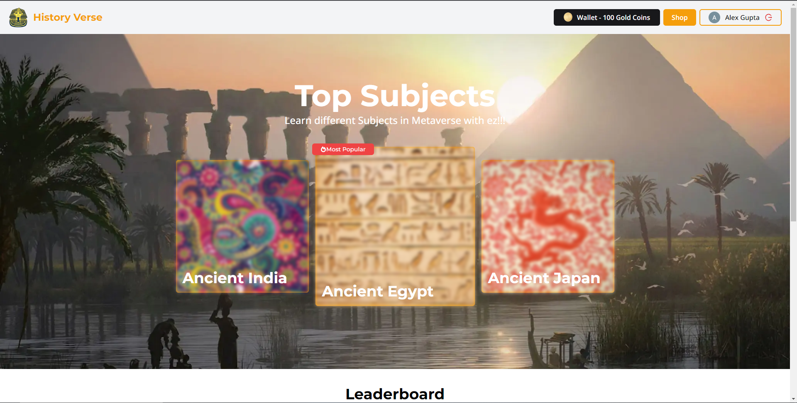
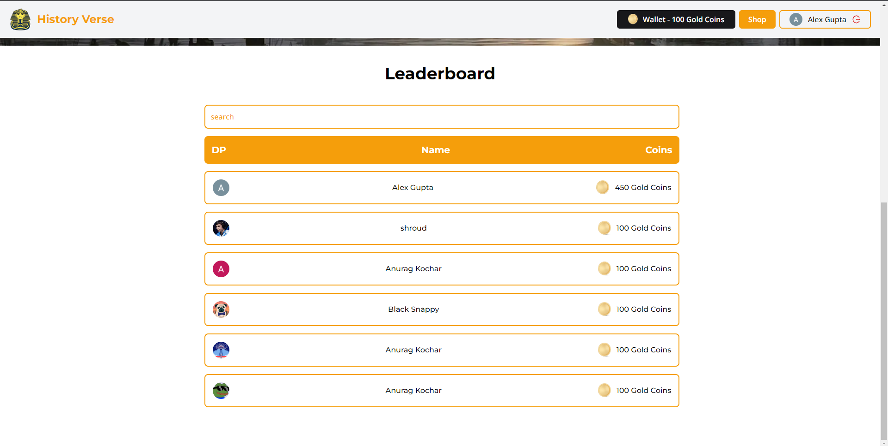

# History Verse : Experience history like never before with our immersive metaverse platform!

## Problem Statement
Learning about history is an essential aspect of education, but traditional methods such as textbooks and videos can often be tedious and unengaging, leading to disinterest in the subject and missed learning opportunities. This lack of engagement can lead to poor academic performance and a decreased interest in history as a subject. 😴📚📹👎

## Solution 
To address these challenges, we propose the development of a metaverse platform 🌌🎮 that provides students with an immersive and interactive learning experience for studying history. By leveraging 3D Environment, interactive classes🎓, and engaging storytelling 📖, students will have the opportunity to explore different eras, civilizations, and events in a way that is engaging and exciting. 💡🌟

In addition to the immersive learning experience, we will also incorporate gamification elements to keep students motivated and engaged. Students can earn virtual currency 🏆💰 in the form of gold coins by giving tests and quizzes, which they can use to climb the leaderboard 🥇🥈🥉and claim rewards 🎁. This will add an element of competition and motivation to the learning experience, encouraging students to participate more actively and enhancing their academic outcomes.

Ultimately, this metaverse platform will inspire the next generation of history enthusiasts 👨‍🎓👩‍🎓 and help to create a more engaged and informed society. 🌍

## Features

